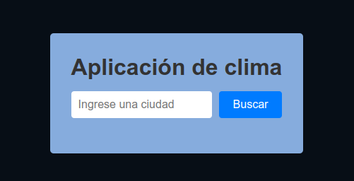
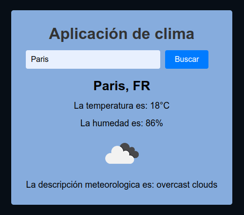

# Descripción del Repositorio
- Este repositorio contiene un proyecto de una aplicacion para saber el clima a nivel mundial utilizando la API de OpenWeather que proporciona datos meteorológicos globales en tiempo real.
Se ingresa en el cuadro de busqueda el nombre de cualquier ciudad del mundo, se da clic sobre el boton "buscar" y se muestran el nombre de la ciudad y las iniciales del país, la tempueratura
actual en grados centigrados, el porcentaje de humedad, un icono del estado del clima y la descripción meteorologica. 
- Para la realizacion de este proyecto se utilizaron las siguientes tecnologias:
  - [Html](https://developer.mozilla.org/es/docs/Web/HTML): Lenguaje de marcado para esrtuctura basica del proyecto en la web.
  - [Css](https://developer.mozilla.org/es/docs/Web/CSS): Lenguaje de estilos para dar presentacion al proyecto web.
  - [Javascript](https://developer.mozilla.org/es/docs/Web/javascript): Lenguaje de programación para desarrollo de forntend y Backend.

## Imagen de la calculadora

